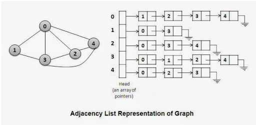
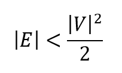
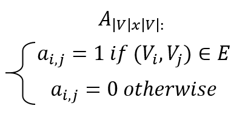

Graphs
=========
implementations of the graph data type and graph realated algorithms by yonatan shatil

graph implementations
=========
a graph is a mathematical structure amounting to a set of objects `V` called vertices(also called nodes or points) and set of pairs of vertices that are "related" `E` each of the related pairs of vertices is called an edge (also called link or line)

## adcency list

the most common implement of graph 
the graph class contains an array of list of size |`V`| 
the list in the nth place reprsent all the vertices which are adjcent(related) to the nth vertex 
exmaple:
 
 
pros using this method:
- getting all the vertices adjcent to a single vertex in O(1) (this method is very usful)
- space complexity of O(E+V) considerd good while  

- adding edge is O(1)

cons using this method:

- checking if 2 vertices are adjcent is O(n)
- removing edge is O(n)

## adcency matrix
another common way to represent graph is using adjcent matrix - a |V|*|V| matrix
the definition of the matrix:  
  
in case of weighted graph the 1 is replaced by the weight of the edge

pros using this method:

- checking if 2 vertices are adjcent is in O(1)
- getting a specific weight of an edge is in O(1)
- all edge manipilation (adding removing seting) is in O(1)  
- the transpose graph is the graph represented by the transposed matrix

cons using this method

- getting all the vertices adjcent to a single vertex in O(n)
- space complexity is always O(V^2)
- adding or earsing a vertex requires to change the whole matrix

## graph.hpp
graph.hpp contains both graph implementations
the methods that are imolemented in the graph class in the graph.hpp are:

- constractors
- copy constractor
- casting constractor (from matrix graph to adjcency list and vic versa)
- is_adjacent : gets index a and index b and returns if a is adjcent to b
- operator[] : gets index and returns the value of the vertex in this index
- setValue : gets index set the value of the vertex in this index 
- allAdjcents : gets index and return all the pairs of indexes and weights that are adjcent to the vertex in this index 
- adjcentBegin : gets index and return the begining of the iterator on its adjcent vertices and wheights
- adjcentEnd : gets index and return the ending of the iterator on its adjcent vertices and wheights
- is_reachable: gets index a and index b and returns if b is reacable from a
- edgeNum : return the number of edges in the graph
- vertNum : return the number of verts in the graph
- order : gets index and return the number of vertex adjcent to the vertex in this index
- getSubGraph : get a set of vertices and returns a sub graph contains only thos vertcies and the edges betwin them
- getTranspose : return the transpose graph (if in the orginal a was adjcent to b then in the transpse graph b is adjcent to a)
- getUnion : gets onather graph and returns a graph which contains both graphes vertices and edges 
- addNode : gets a value and list of vertices the new vert is adcent to and a list of vertices that are adjcent to the new vertex and adds the vertex to the graph
- removeNode : gets index and remove the vertex in this index
- addEdgeByIndexs : get index a and index b and adds a edge betwin them
- dfsBegin: returns dfs iterator for the 0th place of the graph
- dfsEnd: returns dfs iterator for the end of the graph (defined as -1 index)
- bfsBegin: returns bfs iterator for the 0th place of the graph
- bfsEnd: returns bfs iterator for the end of the graph (defined as -1 index)

Algorithms On Graphs
===========
graph are very useful in represnting all sort of data what makes them very generic
all the algorithem below can be used in many cases thanks to that genric proprty

## Dijkstra algorithm:
this algorithe finds the shortest path form source vertex `s` to every vertex on the graph 
this algorithem works on directed and weighted graph without negative weights 
in `algorithem.hpp` this algorithem is implemented using the Graph class and uses the data structure fibonacci heap(found in the file FibonacciHeap.hpp) - this data type helps to improve the time complexity of Dijkstra algo to O(|`E`|+|`V`|log(|`V`|)) 
for more reading on this algorithem and fibonacci heap: 
https://en.wikipedia.org/wiki/Dijkstra%27s_algorithm 
https://en.wikipedia.org/wiki/Fibonacci_heap

## Floyed - Warshel algorithm:
this algorithe finds the shortest path form every vertex to every other vertex on the graph 
this algorithem works on directed and weighted graph 
unlike Dijkstra this algorithem wirks with negative weights 
in `algorithem.hpp` this algorithem is implemented using the Graph class  
the complexity of this algo is O(|`V`|^3) 
for more reading on this algorithem  
https://en.wikipedia.org/wiki/Floyd%E2%80%93Warshall_algorithm

note: this algorithem does not work on graphs with negative cycles 

## Bellman–Ford algorithm:
this algorithe finds the shortest path form vertex `s` to every vertex on the graph 
this algorithem works on directed and weighted graph 
unlike Dijkstra this algorithem wirks with negative weights and allso cand ditect negative cycles 
in `algorithem.hpp` this algorithem is implemented using the Graph class  
the complexity of this algo is O(|`V`|*|`E`|) 
for more reading on this algorithem  
https://en.wikipedia.org/wiki/Bellman%E2%80%93Ford_algorithm

## Topological Sort using DFS:
topological sort of a directed graph is a linear ordering of its vertices such that for every directed edge uv from vertex u to vertex v, u comes before v in the ordering. 
A topological ordering is possible if and only if the graph has no directed cycles 
in `algorithem.hpp` this algorithem is implemented using the Graph class 
the complexity of this algorithem is O(|`E`|+|`V`|) 
for more reading on this algorithem  
https://en.wikipedia.org/wiki/Topological_sorting

## shortest path using Topological Sort:
this algorithe finds the shortest path form source vertex `s` to every vertex on the graph 
this algorithem works on directed and weighted graph without cycles 
unlike Dijkstra this algorithem wirks with negative weights 
in `algorithem.hpp` this algorithem is implemented using the Graph class 
the time complexity of this algo to O(|`E`|+|`V`|)) 
out of all the algorithems for finding the shortest path this one have the best time complexity but is the most ristricted (no cycles) 
for more reading on this algorithem 
https://www.geeksforgeeks.org/shortest-path-for-directed-acyclic-graphs/

## Kruskel algorithm
this algorithe finds the graphs mst - Minimum spanning tree 
Minimum spanning tree is a tree (connected graph with no cycles) which contains all the vertcies of the graph and has the minimum sum of edges weights out of all the trees that contains all the vertcies of the graph 
this algorithem works on indirected and weighted graph 
in `algorithem.hpp` this algorithem is implemented using the IndirectGraph class 
the time complexity of this algo to O(|`E`|log(|`V`|)) 
for more reading on this algorithem and msts 
https://en.wikipedia.org/wiki/Minimum_spanning_tree 
https://en.wikipedia.org/wiki/Kruskal%27s_algorithm

## Prim algorithm
this algorithe finds the graphs mst - Minimum spanning tree 
this algorithem works on indirected and weighted graph 
in `algorithem.hpp` this algorithem is implemented using the IndirectGraph class and uses the data structure Fibonacci heap  
the time complexity of this algo to O(|`E`|+|`V`|log(|`V`|)) 
for more reading on this algorithem 
https://en.wikipedia.org/wiki/Prim%27s_algorithm

## Kosaraju's algorithm
this algorithe finds the graphs scc -  strongly connected components
a strongly connected component is a subgraph in which every vertex is reachable from every other vertex. 
this algorithem works on directed and weighted graph 
in `algorithem.hpp` this algorithem is implemented using the Graph class  
the time complexity of this algo to O(|`E`|+|`V`|) 
there are 2 more scc algorithems that works in O(|`E`|+|`V`|) that in prctice supposed to be more afficent: Tarjan's strongly connected components algorithm and the path-based strong component algorithm  
for more reading on this algorithem and scc 
https://en.wikipedia.org/wiki/Strongly_connected_component 
https://en.wikipedia.org/wiki/Prim%27s_algorithm

## get Super Graph algorithm
this algorithe returns the original graphs super graph
super graph is a graph in which every vertex is a strongly connected componnet of the original graph. 
this algorithm works on directed and weighted graph 
in `algorithem.hpp` this algorithem is implemented using the Graph class  
the time complexity of this algo to O(|`V`|^3) 
this algorithm is not very efficent and can probably be implemented in more efficent way 

## DFS iterator
this algorithm scanns the graphs vertices in depth-first order 
this algorithm works on all graphs 
this algorithm is an iterator class on `GraphsIterator.hpp` 
the time complexity of iterating the graph with this algo is O(|`V`|+|`E`|) 
for more readin on dfs: 
https://en.wikipedia.org/wiki/Depth-first_search

## BFS iterator
this algorithm scanns the graphs vertices in Breadth-first order 
this algorithm works on all graphs 
this algorithm is an iterator class on `GraphsIterator.hpp` 
the time complexity of iterating the graph with this algo is O(|`V`|+|`E`|) 
for more readin on dfs: 
https://en.wikipedia.org/wiki/Breadth-first_search

## nodeRank (PageRank)
this algorithm ranks the "mportancy" of verticies 
vertax `v` importancy is determaned by the importancy of the vertices `u` where (`u`,`v`) is in `E` 
in `algorithem.hpp` this algorithem is implemented using the Graph class  
this algo have the followin parameters:
- iteretions=-1: the amount of iteration to do before returning the importancy vector (-1 means that the iteration will end only in convergence)
- conv_flag=0.000001: each iteration the distance betwin the importancy vector of the previous iteration and the current one is calculeted and if it is smaller than this flag the importancy vector is returned
- self_stay = false :  if this flag is true than then v is considered to be pointing to v if it doesent points to any other vertices
- prob_weights = true : if this flag is true the weights of the edges will be considered as the probability that `u` points to `v` if this flag is false then the weights of the edges are considered to be the amount of points from `u` to `v`
the complexity of 1 iteration is O(|`V`|+|`E`|) 

for more reading: 
https://en.wikipedia.org/wiki/PageRank 
https://www.geeksforgeeks.org/page-rank-algorithm-implementation/ 
https://hackernoon.com/implementing-googles-pagerank-algorithm-88069314fb3d 
https://courses.cs.washington.edu/courses/cse373/17au/project3/project3-3.html

## A* search
this algorithe finds the shortest path form source vertex `s` to destination vertex `d` using a huristic  
this algorithem works on directed and weighted graph without negative weights 
in `Astar.hpp` this algorithem is implemented using the Graph class and uses the data structure fibonacci heap(found in the file `FibonacciHeap.hpp`) 
the complexity of this algo is depended on the huristic function 
for more reading on this algorithem: 
https://en.wikipedia.org/wiki/A*_search_algorithm

other tools
=========
- `Graph Genrator.py` - a python tool that creats directed non weighted graphs in gui and saves them in `gui graphs.txt`
- `graphs.txt` a text file with 10,000 random graphs both directed undirected weighted and non wehited in sizes of 1 to 25 nodes
- `graph test.cpp` a test file that tests the Graph and IndirectGraph methods
- `alorithms test.cpp` a test file that tests all the algoriths in `algorithem.hpp` and `Astar.hpp`
- `comper test.cpp` a test file that compers executing times of some algorithems in `algorithem.hpp` and the old implementation of algorithms in the toolbox directory (A* and dijkstra)
- image directory with images of 10 graphs used in `alorithms test.cpp`
- `tets graphs.txt` a text file with the graphs that are used in the algorithms test

### note: the Fibonacci heap implementation in FibonacciHeap.hpp is by Robin Message (Robin.Message@cl.cam.ac.uk)